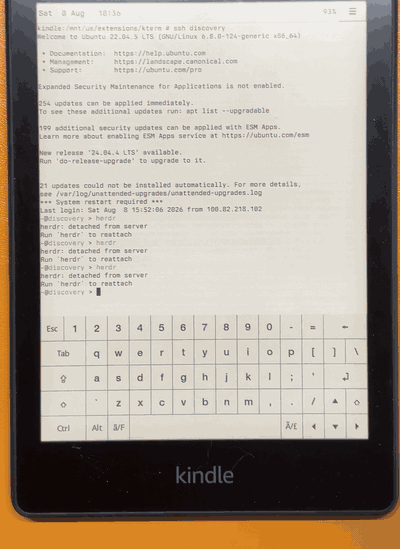

# kterm

A terminal emulator with an on-screen keyboard for jailbroken Kindles.

<p align="center">
  
</p>

<p align="center"><sub>
  Paperwhite 5, ssh into a remote host with panes and touch.
  <a href="docs/demo.mp4">Full quality</a>.
</sub></p>

Fork of [bfabiszewski/kterm](https://github.com/bfabiszewski/kterm), brought up
to date for current firmware and modern terminal programs.

Kindle firmware ships GTK+ 2.20, which pins kterm to **VTE 0.28** — a terminal
emulator from 2011. It types out any escape sequence it does not recognise,
cannot answer the queries programs use to discover the terminal, and predates
SGR mouse reporting by four years. This fork works around all of that from the
outside, without replacing VTE.

## What's different

**Clean prompts.** fish and zsh emit shell-integration sequences (`OSC 7`,
`OSC 133`, `XTMODKEYS`) that VTE 0.28 printed as literal escape debris after
every prompt. Gone — including over ssh, because the filtering happens on the
byte stream rather than in the local shell.

**Light mode is detected.** Programs ask for the background colour with
`OSC 11`. VTE 0.28 never answered, so everything from vim to Claude Code
assumed a dark background and picked an unreadable palette. Now answered
truthfully, and `COLORFGBG` is exported to match.

**Touch works.** A tap is a click, a drag scrolls, and holding for a moment
turns the drag into a real one so you can select text or drag a pane divider.
Legacy X10 mouse reports are rewritten into the SGR form applications actually
ask for.

**Nerd Fonts.** The rootfs is read-only and its fontconfig only scans two
directories, so kterm ships its own. Drop a `.ttf` into `fonts/` and name it in
the config.

**A status bar** with the clock, date and battery, and a menu button — no more
hunting for a two-finger tap.

**Clipboard.** `OSC 52` copies from nvim, tmux and friends reach the Kindle
clipboard.

**Colour that survives e-ink.** 24-bit colour is folded onto an indexed
palette, and the 16 greys are tuned for contrast on paper rather than
synthesised from eight.

Also: builds for hard-float firmware (5.16.3+), settings persist, screen
rotation still works.

## Install

On the Kindle, over ssh:

```sh
curl -sSL https://github.com/szcharlesji/kterm/releases/latest/download/install.sh | sh
```

Then open KUAL and pick **kterm**.

Upgrading keeps your `kterm.conf`, `bin/local.sh` and `menu.json`, and backs the
old install up to `/mnt/us/kterm-backup-*.tar.gz` first.

Or download `kterm-kindle.zip` from
[releases](https://github.com/szcharlesji/kterm/releases) and unzip it into
`/mnt/us/extensions/`.

## Configure

`/mnt/us/extensions/kterm/bin/kterm.conf`:

```sh
font_family = "JetBrainsMono Nerd Font Mono"
font_size = 6
color_scheme = 0          # 0 light, 1 dark
statusbar = 1
touch_hold_ms = 600       # hold before a drag becomes a precise drag
touch_scroll_speed = 100  # 200 scrolls twice as fast
shim = 1                  # the escape sequence filter; 0 talks to VTE directly
```

Put local environment tweaks (`HOME`, `PATH`, ssh config) in
`bin/local.sh` — it is sourced at launch and survives upgrades.

`kterm -h` lists the command line options.

## Gestures

| gesture | result |
| --- | --- |
| tap | click |
| drag | scroll |
| hold, then drag | select text, drag a pane divider |
| two finger tap | menu |
| status bar button | menu |

## How it works

`ktsh` is a small POSIX program that kterm runs the child shell under. It gives
the shell its own pty and filters both directions: dropping sequences VTE would
print, answering colour queries on VTE's behalf, folding 24-bit colour, and
rewriting mouse reports. It has no GTK or glib dependency, so it builds and
unit tests anywhere.

Set `shim = 0`, pass `-S 0`, or set `KTSH_DISABLE=1` to bypass it.
`ktsh -d <file>` logs both byte streams, which is the fastest way to tell
whether a rendering problem is kterm's fault or the application's.

## Build

Needs a Linux host, the KOReader cross-toolchain and a sysroot extracted from
Kindle firmware. See **[BUILD-KINDLE.md](BUILD-KINDLE.md)** — it documents the
target selection, the gaps in the SDK, and the two linker problems that will
otherwise cost you an afternoon.

```sh
./autogen.sh
./configure --host=arm-kindlehf-linux-gnueabihf --enable-kindle \
            --sysconfdir=/mnt/us/extensions/kterm
make dist-kindle
```

`make check` runs the filter tests (on the build host, not cross-compiled).
`tests/touchtest.sh` drives real gestures on the device through XTest.

## Limits

VTE 0.28 cannot do true 24-bit colour, ligatures, Sixel or Kitty graphics, and
no amount of filtering changes that. Keyboard layouts follow the
[original format](layouts/keyboard.xml).

## Licence

GPL-3.0, as upstream.
